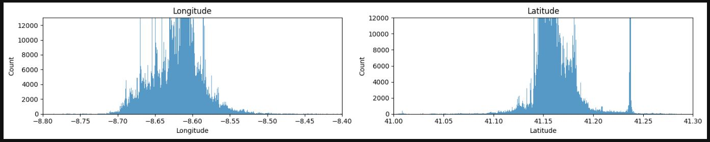
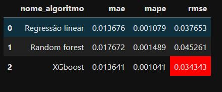
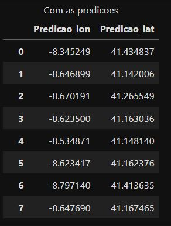

# Taxi Trajectory

Previsão de vendas para uma empresa de medicamentos da europa

## 1.	Problema de negócio
A indústria de táxis está evoluindo rapidamente. Novos concorrentes e tecnologias estão mudando a forma como os serviços de táxi tradicionais fazem negócios. Embora esta evolução tenha criado novas eficiências, também criou novos problemas. 
	Para melhorar a eficiência dos sistemas eletrônicos de despacho de táxis é importante ser capaz de prever o destino final de um táxi enquanto este está em serviço. Particularmente durante períodos de alta demanda, muitas vezes há um táxi cuja corrida atual terminará próximo ou exatamente no local de retirada solicitado por um novo passageiro. Se um despachante soubesse aproximadamente onde seus motoristas de táxi terminariam suas viagens atuais, ele seria capaz de identificar qual táxi atribuir a cada solicitação de coleta.

## 2.	Objetivo
O desafio é criar um modelo capaz de prever as coordenadas WGS84 do destino final com base nos dados disponíveis, melhorando assim a capacidade de despacho dos serviços de táxi.

## 3.	Premissas do negócio
Devido a quantidade de linhas do dataset, foram baixadas 7 das 9 colunas existentes no conjunto de dados.

## 4.	Estratégia adotada para solução

Passo 1 - Descrição dos dados: O objetivo deste passo é ter um entendimento inicial de como os dados estão relacionados com o problema de negócio proposto, para tal, lançando mão de algumas métricas estatísticas de posição e distribuição.

Passo 2 - Engenharia de atributos: Neste passo foram criadas novas variáveis a partir das variáveis originais a fim de melhorar a qualidade dos dados facilitando seu o entendimento.

Passo 3 - Filtragem das variáveis: No processo de filtragem, busca-se selecionar e reter apenas as variáveis relevantes para a análise ou modelagem, com base nos objetivos do negócio e nas características do problema em questão.
 
Passo 4 - Análise exploratória: A análise exploratória dos dados (EDA) tem como principal objetivo proporcionar uma compreensão mais aprofundada dos dados, tais como: Compreender a distribuição das variáveis numéricas e categóricas, identificar outliers (valores atípicos), se existe desbalanceamento da variável resposta, correlações entre as variáveis entre outras análises.

Passo 5 - Preparação dos dados: Neste tópico, os dados serão transformados, ou seja, as variáveis categóricas serão convertidas em números, pois os algoritmos de machine learning não tem uma boa performance com dados não numéricos. Os dados também precisarão ser reescalados, ou seja, colocar as variáveis em uma escala comum.
 
Passo 6 - Seleção das variáveis: Neste passo o principal objetivo é selecionar as variáveis mais relevantes e descartar as menos importantes, para que estas sejam submetidas aos algoritmos de machine learning. Esta seleção é feita através de algoritmos específicos de seleção, com isso, busca-se reduzir a dimensionalidade dos dados sem perder em performance ao resultado final.

Passo 7 - Algoritmos de machine learning: Serão implementados alguns modelos de algoritmos de machine learning para possamos escolher o que melhor performou com os dados disponíveis.
 
Passo 8 - Ajuste dos hiperparâmetros: Com a definição do melhor modelo de machine learning, busca-se otimizar ainda mais a performance do modelo com alguns ajustes finos em seus parâmetros.

Passo 9 - Performance do negócio: Nesta etapa, o termo "performance do negócio" refere-se ao impacto que os modelos e análises têm nos resultados e metas de uma organização, pois busca garantir que as soluções propostas realmente tragam benefícios tangíveis para a empresa.

Passo 10 - Modelo em produção: Nesta etapa final, o melhor modelo treinado é implantado e usado em um ambiente operacional do mundo real. O objetivo principal deste passo de colocar um modelo em produção é transformar o trabalho de desenvolvimento de modelos em um sistema que pode fornecer valor contínuo e automático.

## 5.	Aplicação do modelo de machine learning
Foram feitos testes com vários algoritmos de machine learning, utilizando a técnica de cross-validation e ajuste fino dos parâmetros.

## 6.	Performance do modelo de machine learning
O algoritmo de machine learning escolhido foi o XGBRegressor.
 

## 7	Resultado do negócio
Conforme mostrado na figura abaixo, foram adicionados mais 2 cenários além do predito para as próximas 6 semanas em todas as lojas Rossmann, ou seja, um cenário pessimista e outro otimista, com isso o gestou conseguirá tomar a melhor decisão frente aos valores encontrados.
 
 

## 8.	Conclusão
Através das etapas anteriores, cumprimos com sucesso o desafio proposto, desenvolvendo um algoritmo de machine learning que demonstrou eficácia satisfatória na previsão da posição final dos motoristas de táxi com base nas coordenadas WGS84 disponíveis.

## 9.	Próximos passos
•	Testar outros algoritmos de machine learning;
•	Buscar novas variáveis para definir melhor o comportamento dos clientes;
•	Disponibilizar este modelo para consulta via API.

